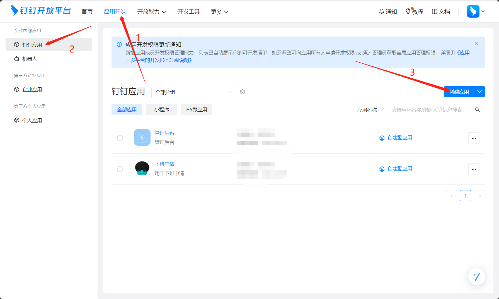
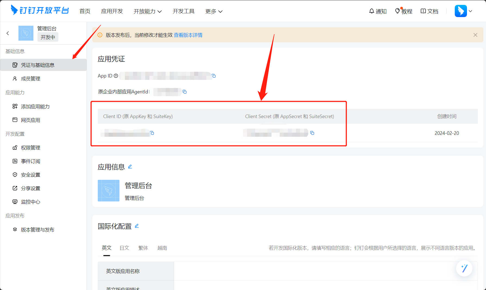
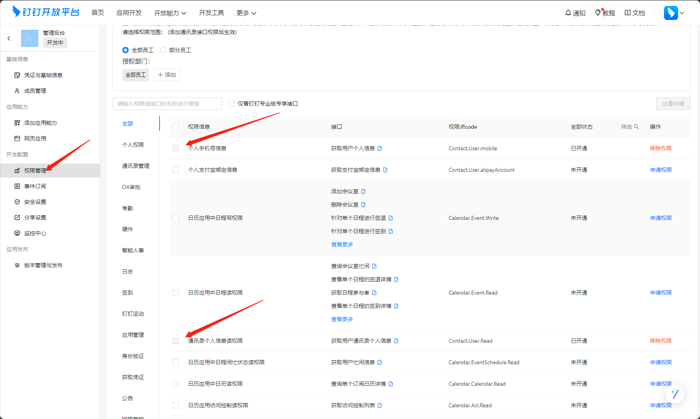
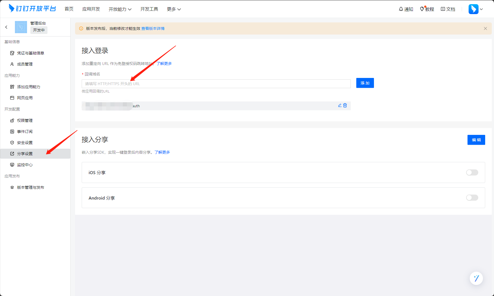

# 钉钉扫码登录demo
> 基于Nodejs


## 如何获取钉钉开放平台配置信息

### 1. 创建应用
1. 访问[钉钉开放平台](https://open.dingtalk.com/)
2. 登录后选择顶部导航栏`应用开发`
3. 选择侧边栏`钉钉应用`
4. 点击右侧`创建应用`
   

### 2. 获取应用凭证
1. 进入应用后，点击侧边栏`凭证与基础信息`
2. 记录 `AppKey` (即 client_id) 和 `AppSecret` (即 client_secret)
   

### 3. 配置权限
1. 点击侧边栏`权限管理`
2. 搜索并开通以下权限：
   - `个人手机号信息`
   - `通讯录个人信息读权限`
   - `企业员工手机号信息`
   

### 4. 配置回调域名
1. 点击侧边栏`分享设置`
2. 在`登录与分享`下配置回调域名
3. 填写你的服务器域名（开发时可以用 localhost:3000）
   

### 5. 修改配置文件
获取到以上信息后，需要修改两个文件：

1. server.js 中修改：
```javascript
const CLIENTID = '你的AppKey' 
const CLIENTSECRET = '你的AppSecret'
```

2. public/index.html 中修改：
```javascript
{
  redirect_uri: encodeURIComponent('你的回调地址'), // 例如：'http://localhost:3000/auth'
  client_id: '你的AppKey'
}
```

## 参考资料
- [实现登录第三方网站](https://open.dingtalk.com/document/isvapp/tutorial-enabling-login-to-third-party-websites)
- [获取用户token api文档](https://open.dingtalk.com/document/orgapp/obtain-user-token)